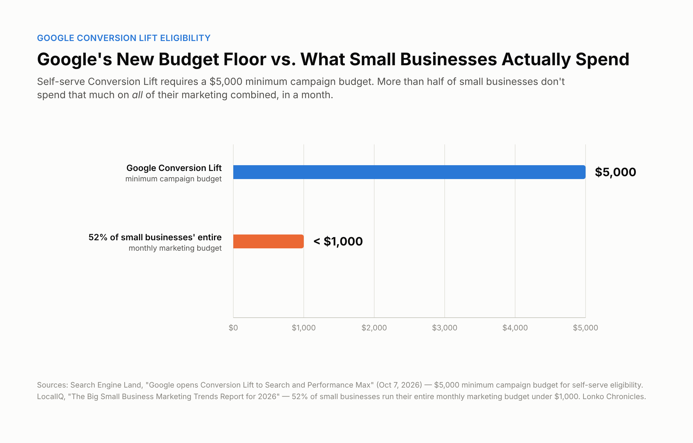

Google wants advertisers to know something that sounds a lot like a straightforward win: you can now measure whether your ads are actually working, not just whether someone clicked after seeing one.

On October 7, 2026, Google Ads expanded self-serve access to Conversion Lift for Search and Performance Max campaigns, bringing those two campaign types in line with Display, Video, Demand Gen, and App campaigns, which were already self-serve eligible. Conversion Lift is Google's incrementality-testing tool: it splits your audience into a group that sees your ads and a holdout group that doesn't, then compares results to estimate how many conversions your ads actually caused, rather than just assigning credit through an attribution model after the fact. Previously, running one of these studies on Search or PMax specifically meant going through a Google representative. Now, for accounts that already have Conversion Lift access, eligible advertisers can set up a Search or PMax study themselves.

That's a real improvement, and it matters for a specific reason: standard conversion tracking tells you what happened after someone saw your ad. It can't tell you whether that conversion would have happened anyway. Incrementality testing is the more honest number, closer to an actual answer to "is this spend doing anything."

## The eligibility bar most small businesses won't clear

Here's the part that didn't make most of the headlines, confirmed directly against Google's own Conversion Lift documentation, not just the announcement coverage. To run a self-serve study on any supported campaign type, including Search and Performance Max, Google requires at least 1,000 observed conversions (not counting conversions from supplementary data) and a minimum $5,000 budget on the participating campaign.

That's the campaign-level bar. There's a separate, account-level one too. Google's documentation states plainly that Conversion Lift isn't available to every account, and that reaching it in the first place still means contacting a Google account representative, the same as alpha and beta campaign types. What changed on October 7 is narrower than "anyone can self-serve now": Search and Performance Max simply joined the list of self-serve-eligible campaign types for accounts that already have Conversion Lift access. Two separate questions decide whether you can actually run a study: whether your account has access at all, and whether your specific campaign clears the conversion and budget thresholds.

Compare those campaign-level numbers against where small businesses actually are. LocalIQ's 2026 small-business marketing report found that 52% of SMBs run their entire monthly marketing budget, not just one campaign, under $1,000. Half have no employees dedicated to marketing at all. For a meaningful share of Lonko's audience, a single campaign clearing a $5,000 budget threshold isn't a stretch goal for next quarter. It's a different budget tier entirely.

<figure><figcaption><em>Context: Google lists a $5,000 minimum campaign budget for the study but does not specify the budget period in the cited documentation. LocalIQ's under-$1,000 figure represents total monthly marketing budget.</em></figcaption></figure>

That doesn't make the announcement meaningless for smaller advertisers. It means the practical question isn't "should I run a Conversion Lift study." For most small businesses right now, the honest answer is you don't yet qualify. The useful question is what to do instead.

## What to actually do if you don't qualify

Standard conversion tracking still works, and it's still worth getting right regardless of whether incrementality testing is available to you. Clean, accurate tracking is the foundation either way: Conversion Lift adds a more honest number on top of a foundation that already needs to be solid, it doesn't replace the need for one.

If you're close to the campaign-budget threshold but not quite there, concentrating budget into fewer, more focused campaigns, rather than spreading the same total spend across many small ones, can help a single campaign clear the $5,000 bar faster than growing your overall spend would. That's a real trade-off (less reach diversification for a shot at better measurement), and it won't be the right call for every business. But budget is only half of the eligibility math. The 1,000-observed-conversion requirement is separate, and concentrating spend doesn't automatically concentrate conversions, especially if the campaigns you'd merge serve different audiences or offers. Check both numbers before assuming consolidation gets you there: a campaign can clear the budget threshold and still fall short on conversion volume, or the other way around.

If you're nowhere near either threshold, the realistic move is watching whether Google adjusts the requirements over time. These thresholds aren't fixed forever, and the account-level access gate described above means not every advertiser type is self-serve eligible yet, even once the campaign-level numbers are within reach. In the meantime, keep relying on well-built standard attribution and cross-check it against whatever directional signals you do have: brand search lift, direct traffic patterns, simple pre/post comparisons when you make a real change.

## Why this isn't really a new problem

This is the same shape of story as Google's broader AI Max rollout: a genuine capability upgrade that assumes a level of budget, conversion volume, or technical access that a lot of small businesses don't have yet. The tools are real. The access gap is real too. Reading past the headline, before deciding whether a given Google Ads announcement is relevant to your business specifically, is the actual skill worth building here, not any one feature.

## What's still uncertain

Google's documentation doesn't specify whether the $5,000 campaign budget is evaluated monthly, over the life of the study, or some other window. That detail is worth confirming directly with your account team before you assume either way. It's also unclear whether Google will extend self-serve setup to alpha and beta campaign types, or loosen the account-level access gate, as the tooling matures. Right now, account-level access and self-serve setup for a specific campaign type are two separate things, and Google's documentation doesn't say how long that will stay true.

## The bottom line

Google's Conversion Lift expansion is a genuine step toward more honest ad measurement, not just a bigger dashboard. But "more honest measurement is now available" and "more honest measurement is now available to you" are two different claims, and the gap between them is exactly where most small-business budgets currently sit. Knowing which side of that threshold you're actually on is worth five minutes of checking your numbers, rather than assuming a Google Ads headline either definitely applies to you or definitely doesn't.

## Sources & Further Reading
- [Google Ads Help: Set up Conversion Lift based on users](https://support.google.com/google-ads/answer/12005564) (official documentation: supported campaign types, the 1,000+ observed-conversion threshold, the $5,000 minimum campaign budget, and account-level access requirements)
- [Search Engine Land: Google opens Conversion Lift to Search and Performance Max](https://searchengineland.com/google-opens-conversion-lift-to-search-and-performance-max-494195) (Anu Adegbola, published October 7, 2026)
- [Search Engine Land: Google Ads adds new AI Max columns for deeper campaign analysis](https://searchengineland.com/google-ads-adds-new-ai-max-columns-for-deeper-campaign-analysis-494170) (published October 7, 2026)
- [LocalIQ: The Big Small Business Marketing Trends Report for 2026](https://localiq.com/blog/small-business-marketing-trends-report-2026/)
