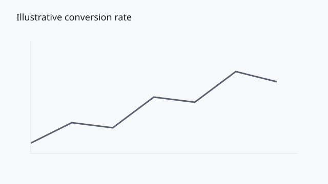

## What this piece covers

Report literacy. Marketing teams often collect more platform reports than they can interpret. The useful question is rarely what the dashboard shows first — it is which signal deserves attention before spend or creative changes. Lonko Chronicles fixtures use synthetic scenarios so the publishing system can be tested end-to-end.

## Section 1

In scenario 1, evidence from advertising, analytics, and on-site behavior must be weighed together. A stable click volume with declining conversion rate is a different problem than a sudden traffic drop. Report literacy. Marketing teams often collect more platform reports than they can interpret. The useful question is rarely what the dashboard shows first — it is which signal deserves attention before spend or creative changes. Lonko Chronicles fixtures use synthetic scenarios so the publishing system can be tested end-to-end.

## Section 2

In scenario 2, evidence from advertising, analytics, and on-site behavior must be weighed together. A stable click volume with declining conversion rate is a different problem than a sudden traffic drop. Report literacy. Marketing teams often collect more platform reports than they can interpret. The useful question is rarely what the dashboard shows first — it is which signal deserves attention before spend or creative changes. Lonko Chronicles fixtures use synthetic scenarios so the publishing system can be tested end-to-end.

## Section 3

In scenario 3, evidence from advertising, analytics, and on-site behavior must be weighed together. A stable click volume with declining conversion rate is a different problem than a sudden traffic drop. Report literacy. Marketing teams often collect more platform reports than they can interpret. The useful question is rarely what the dashboard shows first — it is which signal deserves attention before spend or creative changes. Lonko Chronicles fixtures use synthetic scenarios so the publishing system can be tested end-to-end.

## Section 4

In scenario 4, evidence from advertising, analytics, and on-site behavior must be weighed together. A stable click volume with declining conversion rate is a different problem than a sudden traffic drop. Report literacy. Marketing teams often collect more platform reports than they can interpret. The useful question is rarely what the dashboard shows first — it is which signal deserves attention before spend or creative changes. Lonko Chronicles fixtures use synthetic scenarios so the publishing system can be tested end-to-end.

## Section 5

In scenario 5, evidence from advertising, analytics, and on-site behavior must be weighed together. A stable click volume with declining conversion rate is a different problem than a sudden traffic drop. Report literacy. Marketing teams often collect more platform reports than they can interpret. The useful question is rarely what the dashboard shows first — it is which signal deserves attention before spend or creative changes. Lonko Chronicles fixtures use synthetic scenarios so the publishing system can be tested end-to-end.

## Section 6

In scenario 6, evidence from advertising, analytics, and on-site behavior must be weighed together. A stable click volume with declining conversion rate is a different problem than a sudden traffic drop. Report literacy. Marketing teams often collect more platform reports than they can interpret. The useful question is rarely what the dashboard shows first — it is which signal deserves attention before spend or creative changes. Lonko Chronicles fixtures use synthetic scenarios so the publishing system can be tested end-to-end.

## Section 7

In scenario 7, evidence from advertising, analytics, and on-site behavior must be weighed together. A stable click volume with declining conversion rate is a different problem than a sudden traffic drop. Report literacy. Marketing teams often collect more platform reports than they can interpret. The useful question is rarely what the dashboard shows first — it is which signal deserves attention before spend or creative changes. Lonko Chronicles fixtures use synthetic scenarios so the publishing system can be tested end-to-end.

::: pullquote
If a report does not change a decision, it is decoration.
:::

## What this piece covers

After the chart. Marketing teams often collect more platform reports than they can interpret. The useful question is rarely what the dashboard shows first — it is which signal deserves attention before spend or creative changes. Lonko Chronicles fixtures use synthetic scenarios so the publishing system can be tested end-to-end.

## Section 1

In scenario 1, evidence from advertising, analytics, and on-site behavior must be weighed together. A stable click volume with declining conversion rate is a different problem than a sudden traffic drop. After the chart. Marketing teams often collect more platform reports than they can interpret. The useful question is rarely what the dashboard shows first — it is which signal deserves attention before spend or creative changes. Lonko Chronicles fixtures use synthetic scenarios so the publishing system can be tested end-to-end.

## Section 2

In scenario 2, evidence from advertising, analytics, and on-site behavior must be weighed together. A stable click volume with declining conversion rate is a different problem than a sudden traffic drop. After the chart. Marketing teams often collect more platform reports than they can interpret. The useful question is rarely what the dashboard shows first — it is which signal deserves attention before spend or creative changes. Lonko Chronicles fixtures use synthetic scenarios so the publishing system can be tested end-to-end.

## Section 3

In scenario 3, evidence from advertising, analytics, and on-site behavior must be weighed together. A stable click volume with declining conversion rate is a different problem than a sudden traffic drop. After the chart. Marketing teams often collect more platform reports than they can interpret. The useful question is rarely what the dashboard shows first — it is which signal deserves attention before spend or creative changes. Lonko Chronicles fixtures use synthetic scenarios so the publishing system can be tested end-to-end.
